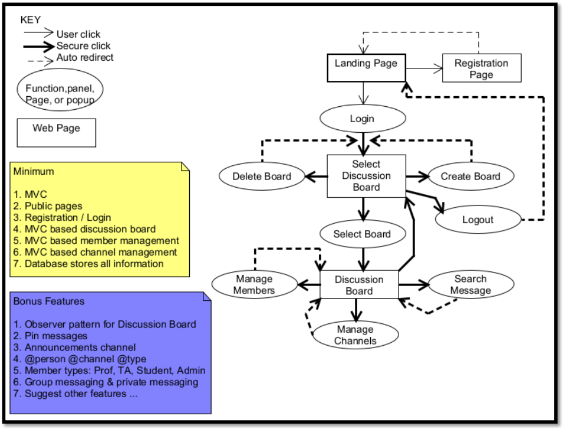

# COMP 307 Fall 2023 Project

## About The Project

### Built With

* [![Bootstrap][Bootstrap.com]][Bootstrap-url]


## Getting Started

### Installation

1. [Add SSH key to Github account](https://docs.github.com/en/authentication/connecting-to-github-with-ssh)
2. Navigate to C:\xampp\htdocs
3. Clone the repo
   ```sh
   git clone git@github.com:3FI/COMP-307-Project.git
   ```


## Roadmap



- [x] Landing page
    - [X] Login form
- [x] Registration page
- [ ] Select Discussion Board page
    - [ ] Create Board functionality
    - [ ] Delete Board functionality
    - [ ] Select Board functionality
- [ ] Discussion Board page
    - [ ] Discussion board A
    - [ ] Discussion board B
    - [ ] Discussion board C
    - [ ] Manage Channels functionality
    - [ ] Manage Members functionality
    - [ ] Search Messages functionality


## Contact

* Matan Atlas - matan.atlas@mail.mcgill.ca
* Étienne Cadotte - etienne.cadotte@mail.mcgill.ca
* Sissy Chen - xi.chen20@mail.mcgill.ca
* Louis-Antoine Habre - louis-antoine.habre@mail.mcgill.ca


## Acknowledgments

* [Best README Template](https://github.com/othneildrew/Best-README-Template/blob/master/README.md)


[Bootstrap.com]: https://img.shields.io/badge/Bootstrap-563D7C?style=for-the-badge&logo=bootstrap&logoColor=white
[Bootstrap-url]: https://getbootstrap.com